# amazon-cli

amazon-cli application includes three javascript files that can be used to manage inventory.
## $ node bamazonCustomer.js

**When we run the customer application 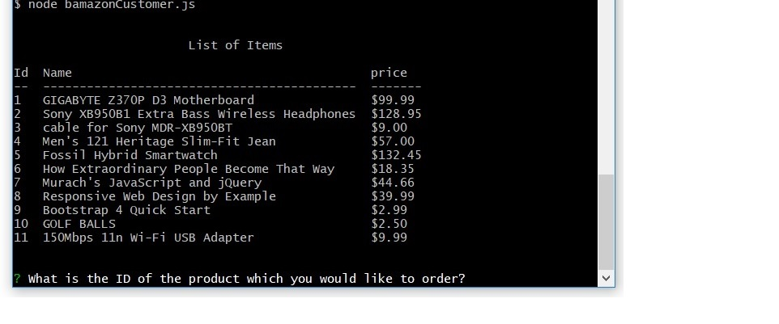
**When we purchase a product 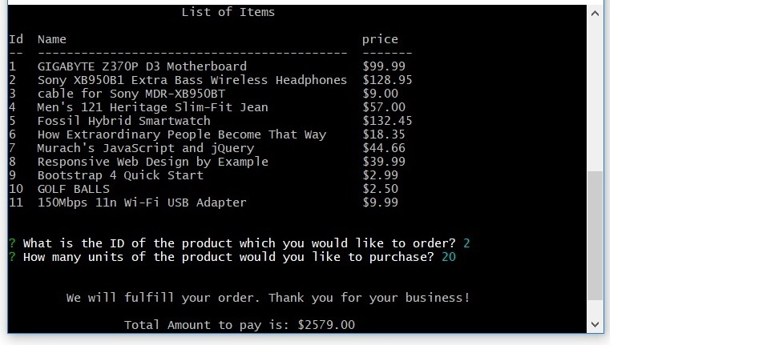
**Before accepting the order, it checks stock availability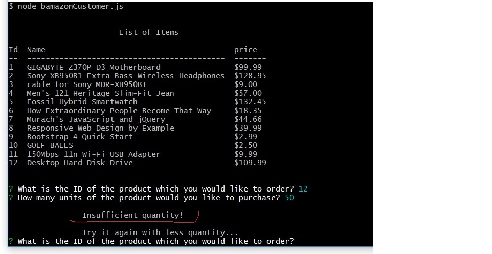
**Also, it checks for entering correct item Id 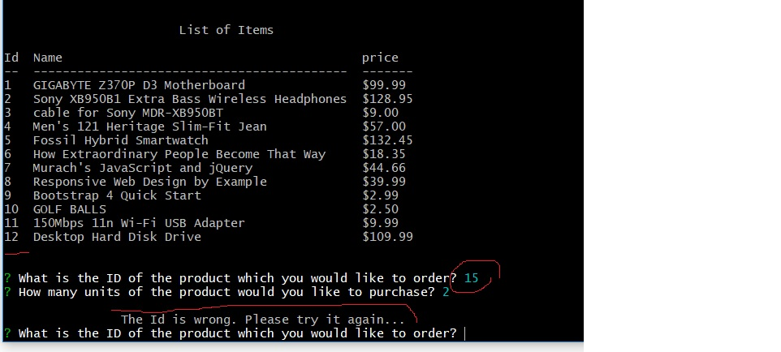

## $ node bamazonManager.js
**When we run the manager section of the application:
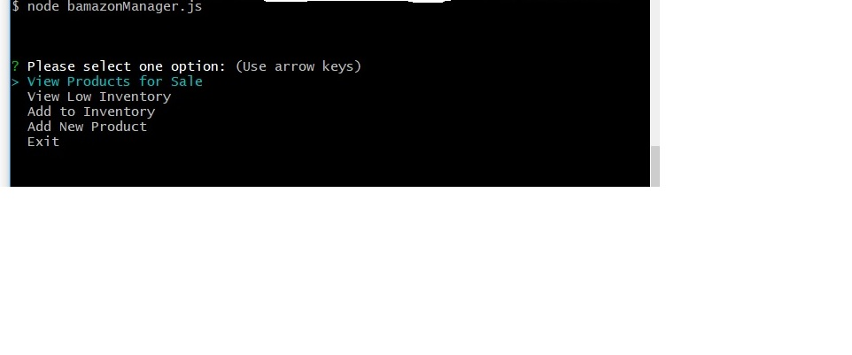
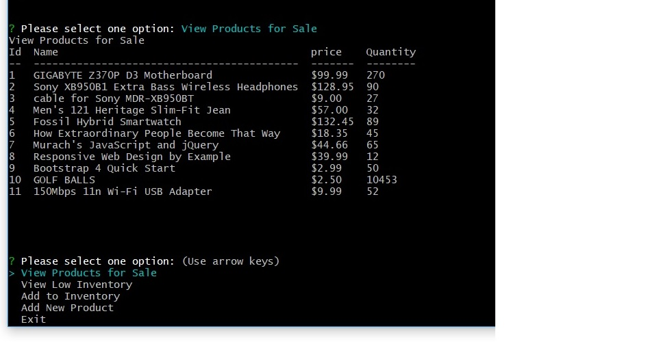
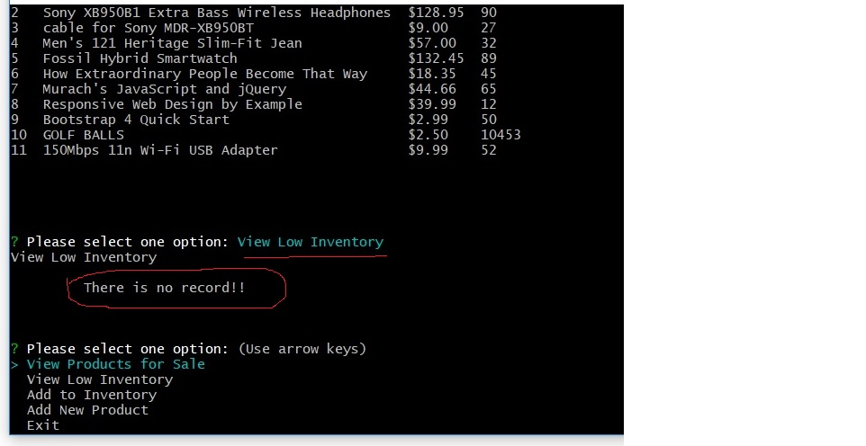
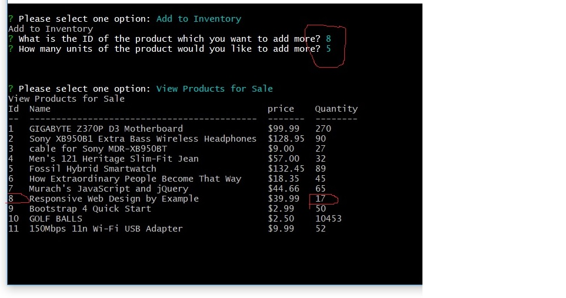
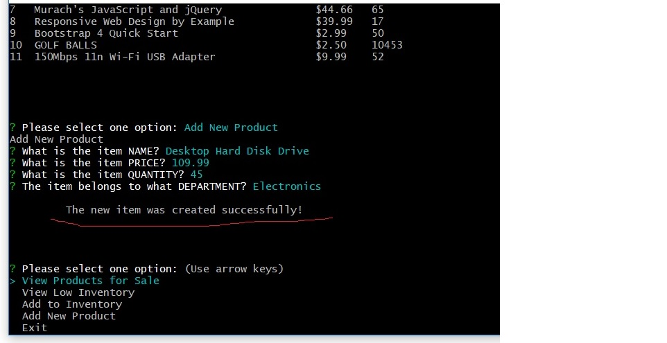
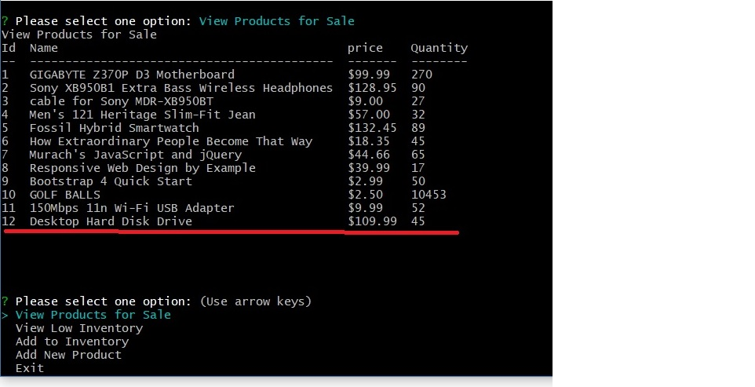

## $ node bamazonSupervisor.js

** Supervisor part of the application :
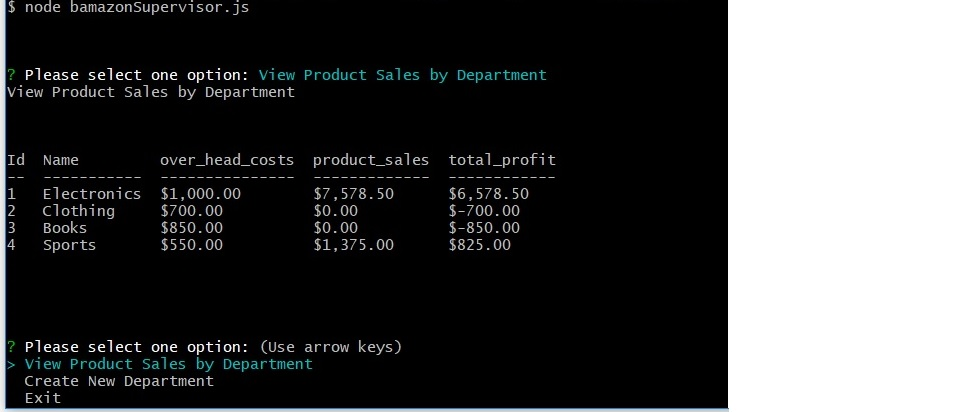
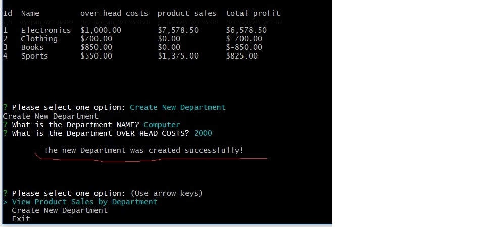

